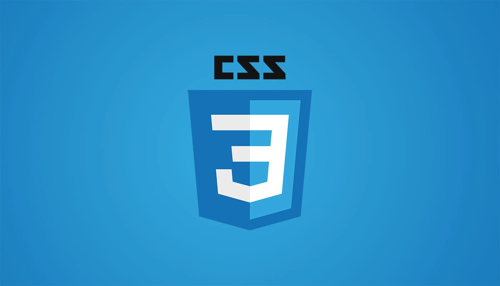

# Fork-Byte-Code Front-end Restaurant Food Review Site

This website is dedicated to foodies wanting restaurant recommendations as well as posting reviews for them.
 
 

## Project Outline 🖊️

We utilised a restaurant review API for our backend to create a react app. We also imported MUI to create a modal review feature, as well as using the bootstap framework for our carousel.
 
 
## Tech Stack 👩‍💻

 
 

## MVP 

Before starting our project, we defined our MVP as follows:

- Have a home page with a navbar and footer.
- Have search functionality to allow users to find a specific restaurant or cuisine.
- Display restaurants as a list when searching.
- Be able to view all restaurants from the API.
- Be able to view all reviews from the API.
- Basic CSS styling.

## Extensions 

We were able to implement the following extensions once our MVP was achieved:
- Used MUI to create modals to show and add reviews.
- Used Bootstrap to implement a carousel as part of our hero section of the homepage.
- Convert restaurant from a list to its own cards using CSS.
- Be able to add reviews to a restaurant.
- Imported a custom font for our review 'receipt'
- Implemented media queries to adjust various elements accordingly.

## How to use this app❓

1. Fork and clone the back-end API: https://github.com/e-b-m/team_1_food_review
2. In the terminal run the following command: `createdb food_review`
3. Run the API 
4. Fork and clone this repo.
5. In the terminal run the following commands: 
     
 `npm install`
     
  `npm install react-router-dom@6`
      
  `npm install react-bootstrap bootstrap`
     
 `npm install @emotion/react`
     
  `npm install @mui/base`
     
  `npm install @emotion/styled`

  6. Last command I promise! 
   
  `npm start`
  ### **Tada!** 🎉

## Future extensions we would have liked to include 
Whilst we are proud of the app we produced in the short space of time we had. These are some implementations we would have loved to include:

1. User functionality - right now the user of our app doesn't need to login to be able to add reviews. But in future we would like this feature not only so that users can post reviews but also save restaurants, create a favourites list etc. 
2. Adding maps to each restaurant - Currently the backend has no address associated to each restaurant, had we more time we would have found a front-end solution to allow each restaurant to have an associated address to allow users to use maps to find directions.
3. Adding images to restaurants - we would have liked each restaurant to have an image, given that the backend has no image associated with each restaurant we would like to use another API that allows us to have this feature.
4. Adding restaurant - whilst you can add reviews, you can't add new restaurants so this is a feature we would like to include.

## Team 💻

**Berna Yasar**: [Byasar3](https://github.com/Byasar3)
**Eesaa Sheikh**: [eesaa-sheikh](https://github.com/eesaa-sheikh)
**Nadia Djeridi**: [nadia-dj98](https://github.com/nadia-dj98)
